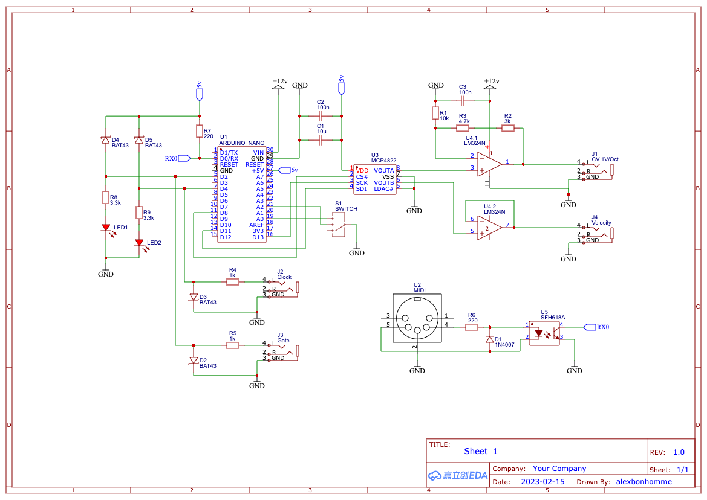

# Midi to CV

> Thanks to the work of [Larry McGovern](https://github.com/elkayem/midi2cv) in the midi2cv project

> Thanks to the work of [HAGIWO](https://note.com/solder_state/n/n17e028497eba)

## Schematic

> WIP

