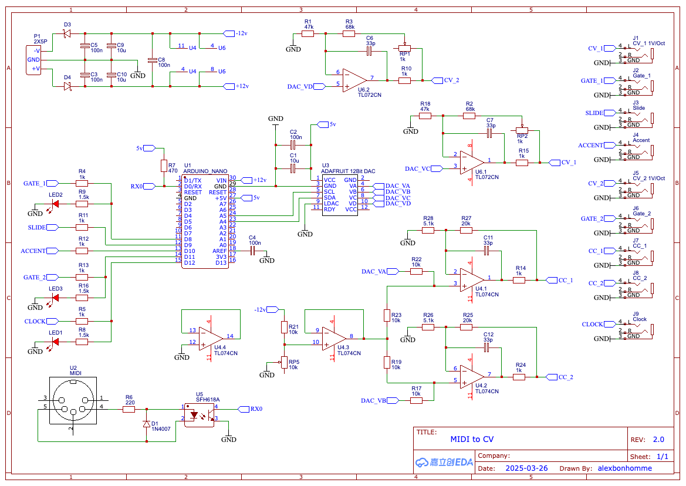

# Midi to CV version 2

> Huge thanks for [Befaco](https://github.com/Befaco) and the open source design of the [midithing](https://github.com/Befaco/midithing/tree/master) module

> Big up to [Erica Synths](https://github.com/erica-synths/diy-eurorack) open source designs

> The 303 slide behavior would not haven been be possible without the reverse engenering of [Devil Fish](https://www.firstpr.com.au/rwi/dfish/303-slide.html)

## Schematic

