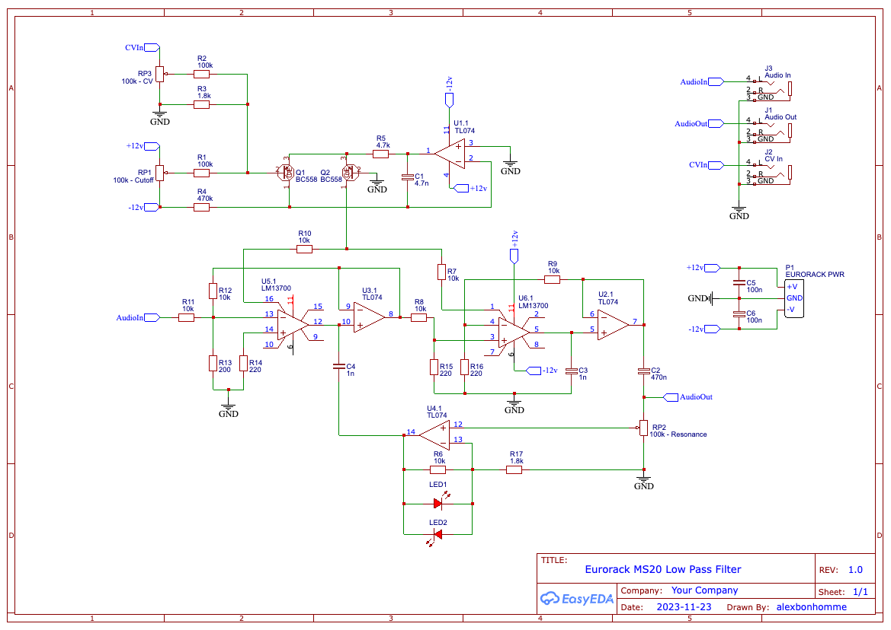

# MS20 Low Pass Filter

Korg MS20-style voltage-controlled low-pass filter (VCF) for Eurorack. Analog design; replicates the character of the MS20 filter. **Status: WIP** (work in progress).

## Features

- Classic MS20 VCF response and resonance
- Voltage-controlled cutoff (and resonance where applicable)
- Eurorack power and signal levels
- Schematic and layout in repo for DIY build

## Credits

- [Rene Schmitz](https://www.schmitzbits.de/ms20.html) — MS20 filter analysis and reference schematic
- [LOOK MUM NO COMPUTER](https://www.lookmumnocomputer.com/simple-filter) — Simple filter build reference
- [lu.caas (Discourse)](https://lookmumnocomputer.discourse.group/t/ms20-vcf-schematic/2552/9) — MS20 VCF schematic discussion

## Schematic

