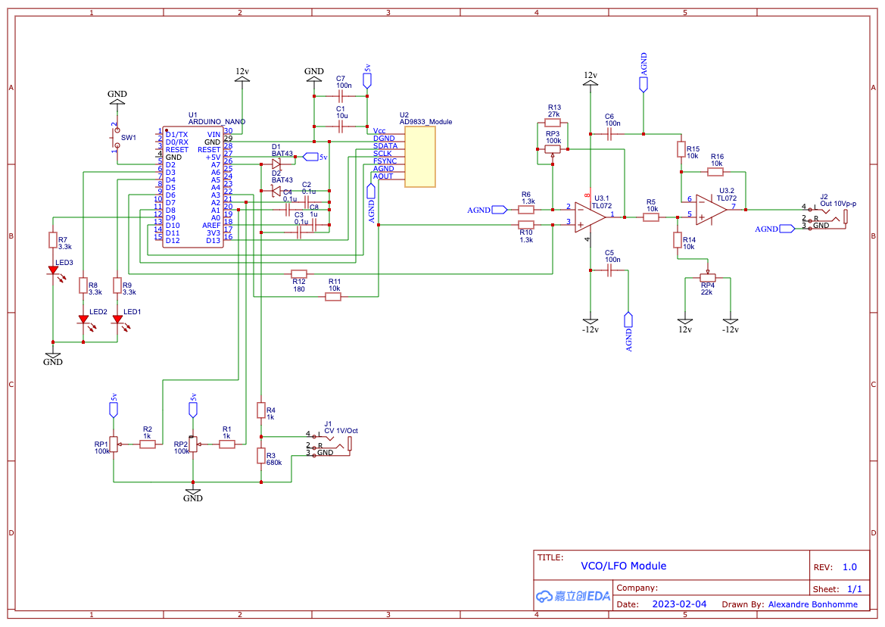

# VCO/LFO

> Thanks to the awesome work of [HAGIWO](https://note.com/solder_state/n/nd2c22a73e8fe)

> Also inspired by [Cezar Chirila](https://www.allaboutcircuits.com/projects/how-to-DIY-waveform-generator-analog-devices-ad9833-ATmega328p/) design.

## Schematic

- RP1: Frequency potentiometer
- RP2: Frenquency range potentiometer
- RP3: Gain potentiometer
- RP4: Precision potentiometer to set bias voltage
- J1: CV input (1V/Oct)
- J2: Output (10V/p-p)
- SW1: Push button to switch between Sine, Triangle and Square signal
- LED1/LED2: Indicate current signal type
- LED3: LFO rate (shutdown in VCO range)

