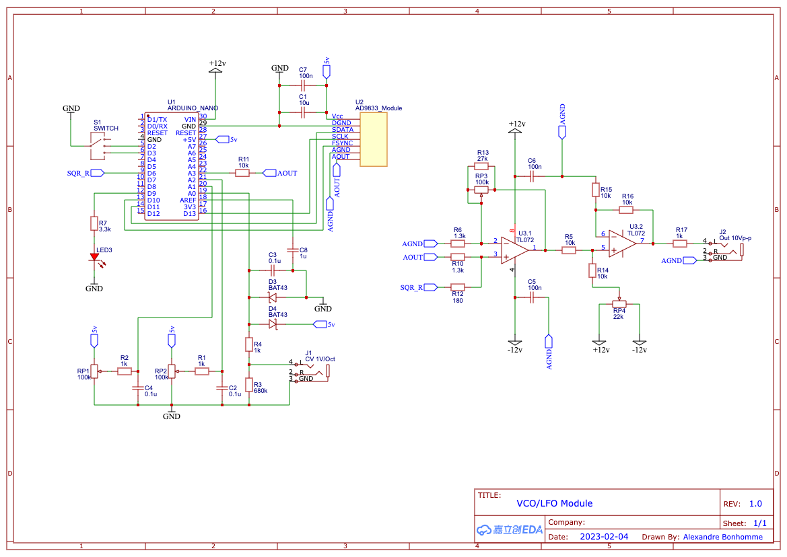

# VCO/LFO

VCO and LFO module based on Arduino UNO and the AD9833 programmable waveform generator. Produces sine, triangle, and square waves with 1V/octave CV input. Suitable for both audio (VCO) and modulation (LFO) use.

## Features

- Waveforms: sine, triangle, square (selectable via push button)
- 1V/oct CV input (J1)
- Frequency potentiometer and range pot
- Gain and precision bias (tuning) potentiometers
- LEDs indicate current waveform; separate LED for LFO rate when in LFO range
- Output: 10 V peak-to-peak (J2)

## Credits

- [HAGIWO](https://note.com/solder_state/n/nd2c22a73e8fe) — original design and inspiration
- [Cezar Chirila](https://www.allaboutcircuits.com/projects/how-to-DIY-waveform-generator-analog-devices-ad9833-ATmega328p/) — AD9833 + ATmega328p design reference

## Schematic reference

- **RP1** — Frequency
- **RP2** — Frequency range
- **RP3** — Gain
- **RP4** — Precision bias voltage
- **J1** — CV input (1V/oct)
- **J2** — Output (10 V p-p)
- **SW1** — Push button: cycle Sine → Triangle → Square
- **LED1/LED2** — Waveform type
- **LED3** — LFO rate (off in VCO range)

